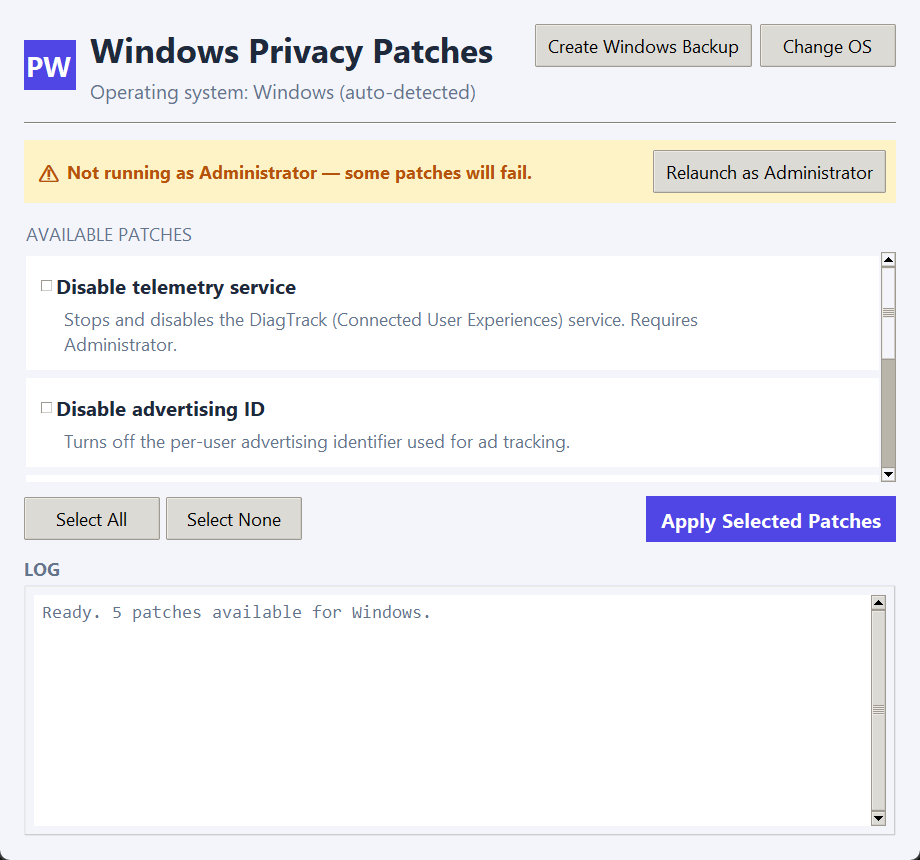
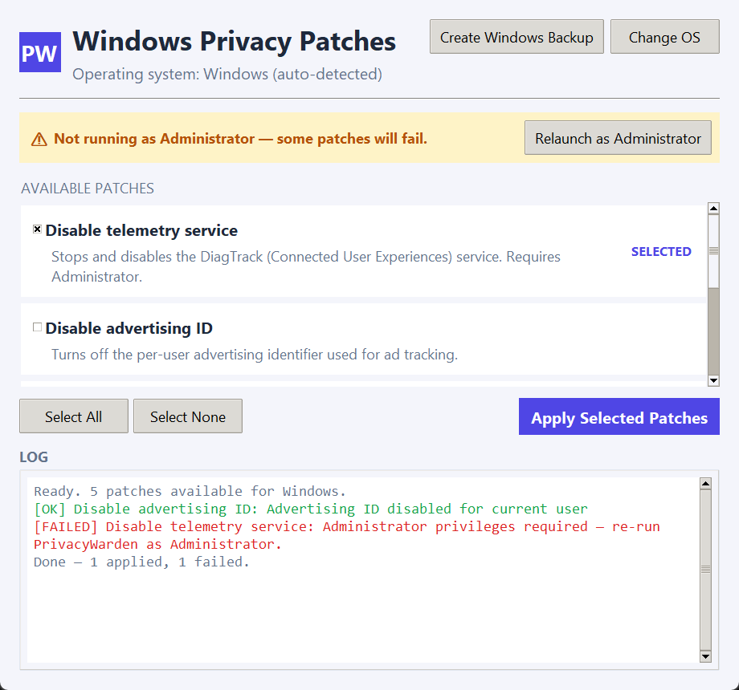
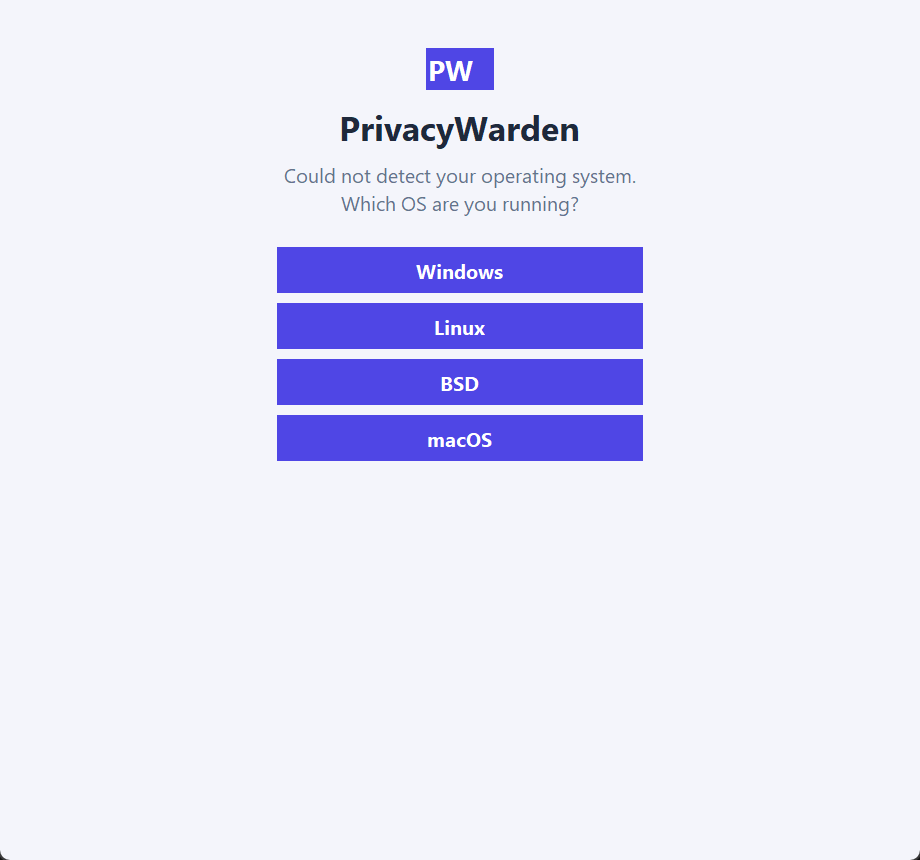
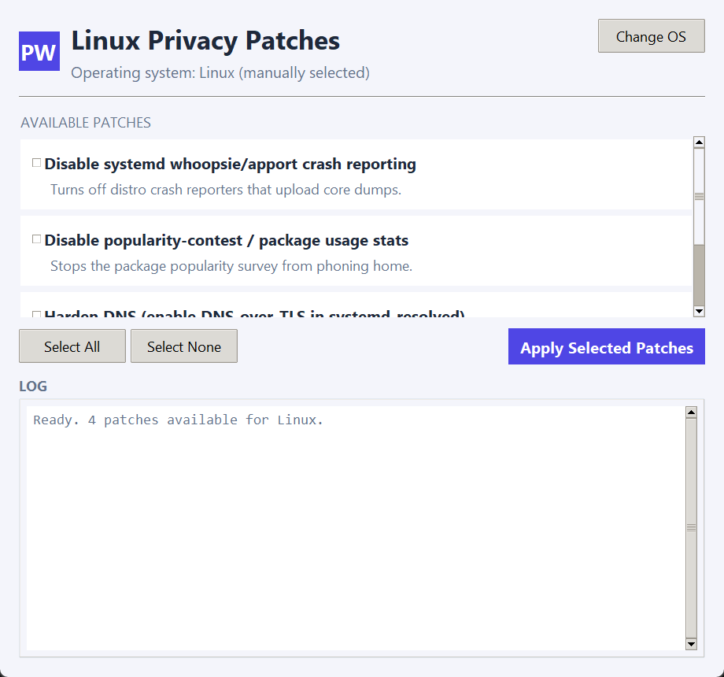
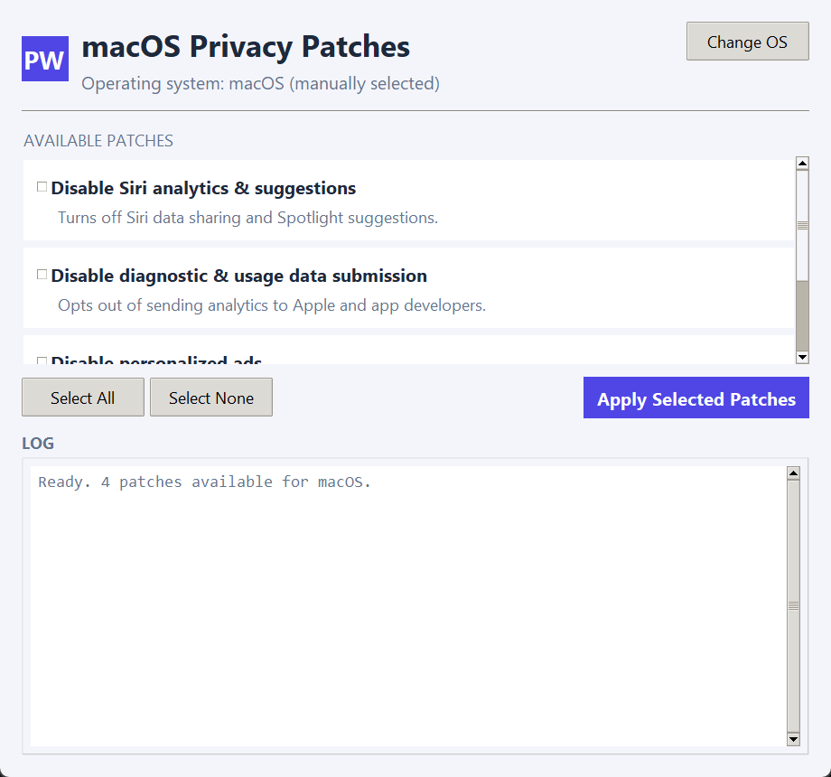
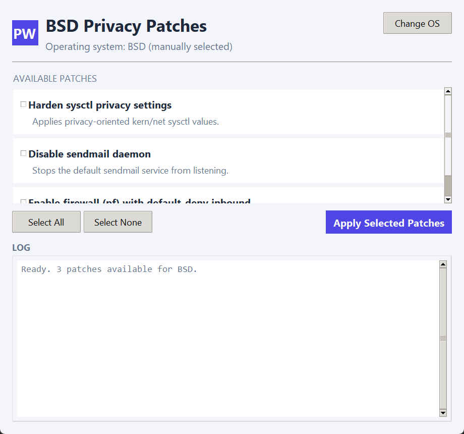

# PrivacyWarden 🛡️✨

A small cross-platform desktop app (Tkinter) that lists common privacy-hardening
tweaks for your OS, lets you pick which ones to apply, and runs them for you.
It auto-detects Windows, Linux, BSD, or macOS on launch and shows the matching
patch list.

Windows is the fully-implemented platform right now (real registry/service
changes). Linux, macOS, and BSD are scaffolded with stub actions, ready to be
filled in with real implementations — see [Contributing](#contributing--notes-).

## Why use this? 💡
- One place to review and toggle privacy-related OS settings instead of
  hunting through Settings/registry/systemd by hand
- Every apply run is written to a plain-text log (`output.out`) with a
  per-patch success/fail result, so you have a record of what changed and when
- Your checkbox choices are remembered between launches (`patch_settings.json`)
- On Windows, a one-click button creates a System Restore point before you
  start flipping settings

## Screenshots

**Windows patch screen** — default state (all patches start unchecked; a
banner appears if the app isn't running elevated, since several patches need
Administrator):



**Windows patch screen** — with a couple of patches selected (note the
"SELECTED" tag) and a log entry for a completed apply run:



**OS not detected** — manual OS picker shown when auto-detection fails:



**Linux, macOS, and BSD** patch screens (currently stubbed actions):





## Current feature set

- **OS auto-detection** with a manual picker fallback (Windows, Linux, BSD, macOS)
- **Real Windows patches** (see table below) — everything else is a stub
  action ready to be implemented per OS
- **Per-patch checkboxes** with a "SELECTED" tag that appears next to any
  patch you've ticked; all patches are **unchecked by default**
- **Persistent selections** — your checked/unchecked state is saved to
  `patch_settings.json` (next to `main.py`) and restored the next time you
  launch the app, per OS
- **Apply log** — a colored in-app log panel (green = success, red = failed)
  plus a durable `output.out` file that records a timestamped line per patch
  (`SUCCESS`/`FAILED` + detail) for every apply run
- **Administrator awareness (Windows)** — detects whether the app is elevated
  and shows a "Relaunch as Administrator" button when it isn't, since several
  patches require it
- **Windows System Backup button** — creates a System Restore point
  (`Checkpoint-Computer`) before you apply changes, so you can roll back via
  Windows' built-in System Restore if something breaks

### Windows patches

| Patch | What it does | Needs Admin? |
|---|---|---|
| Disable telemetry service | Stops and disables the DiagTrack (Connected User Experiences) service | Yes |
| Disable advertising ID | Turns off the per-user advertising identifier used for ad tracking | No |
| Disable Cortana / online search | Turns off Bing web search and Cortana consent in Start Menu search | No |
| Disable activity history upload | Disables Timeline/activity feed publishing and upload via policy | Yes |
| Disable diagnostic data (Required only) | Sets the telemetry level to the minimum the edition allows | Yes |

## Quick start 🚀

1. Create a venv and activate it.

Windows (PowerShell):
```powershell
python -m venv venv
venv\Scripts\Activate.ps1
```
macOS / Linux:
```bash
python -m venv venv
source venv/bin/activate
```

2. Run it — no external dependencies, just the Python standard library
   (Tkinter):
```powershell
python main.py
```

The app auto-detects your OS and opens straight to its patch screen. Tick the
patches you want, hit **Apply Selected Patches**, and watch the log panel.

On Windows, several patches (and the backup button) require Administrator —
if you're not elevated, use the **Relaunch as Administrator** button that
appears on the patch screen.

## Safety first ⚠️

- Patches make real changes to your system (registry values, services) —
  there's no simulated dry-run mode, so review the description on each patch
  card before applying
- Use the **Create Windows Backup** button to make a System Restore point
  first; Windows only allows one restore point per 24 hours by default
- Check `output.out` after a run to confirm what succeeded and what didn't

## Contributing & notes 📝

- Patches live in the `PATCHES` dict in `main.py`, keyed by OS. Each entry is
  `{"name": ..., "desc": ..., "apply": callable() -> str}` — `apply` performs
  the change and returns a short status string, or raises on failure
- Linux, macOS, and BSD patches are currently `_stub(...)` placeholders;
  replace them with real implementations (e.g. `subprocess` calls to
  `systemctl`/`gsettings`/`defaults write`/`sysctl`) following the pattern
  used by the `_win_*` functions
- `output.out` and `patch_settings.json` are created next to `main.py` on
  first run — they're user-local state, not meant to be committed

## License

No license included — add `LICENSE` if you want to open-source.

Questions or help? Open an issue or PR. 🙌
